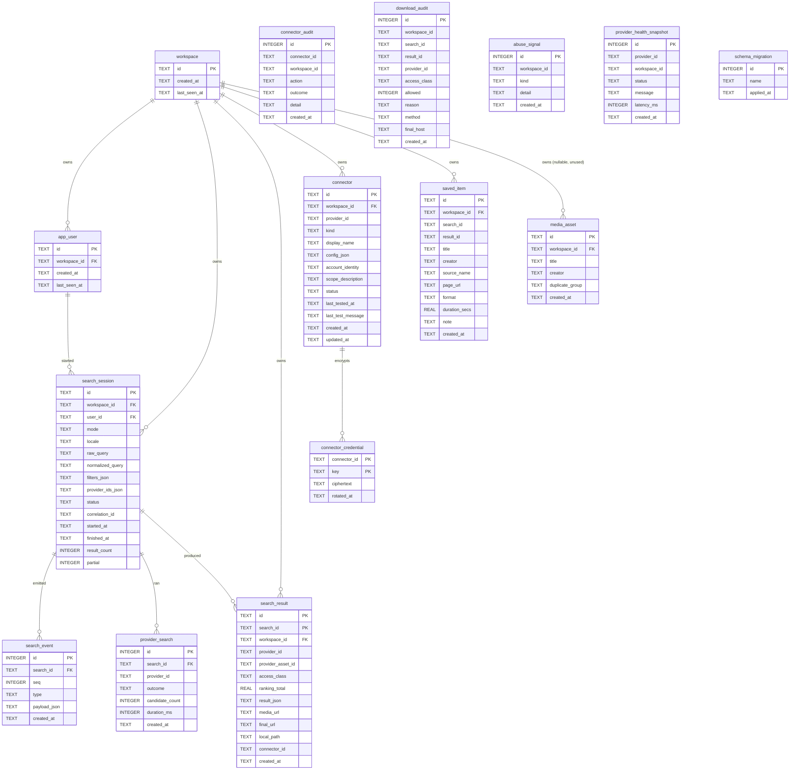

# Data model

Auralis stores very little and computes a lot. Most of the vocabulary you meet
in the code is a TypeScript type that lives in memory for the length of a search
and, if it survives at all, survives inside a JSON column.

This document is precise about which is which, because the alternative — a
diagram full of tables that do not exist — is worse than no diagram.

Sources: `packages/server/src/db/schema.ts` (the only place `CREATE TABLE`
appears), `packages/server/src/db/database.ts`,
`packages/server/src/db/repositories.ts`, `packages/server/src/db/connectors.ts`,
and the domain types under `packages/core/src/domain/`.

---

## What is a table and what is not

`MIGRATIONS[0]` in `schema.ts` is the entire physical schema. `database.ts`
adds one more table (`schema_migration`) at migration time.

### Physical SQLite tables

| Table                      | Created in                | Written by                                                             |
| -------------------------- | ------------------------- | ---------------------------------------------------------------------- |
| `schema_migration`         | `database.ts` `migrate()` | `migrate()`                                                            |
| `workspace`                | `schema.ts`               | `WorkspaceRepository.create` / `.touch`                                |
| `app_user`                 | `schema.ts`               | `WorkspaceRepository.create` / `.touch`                                |
| `search_session`           | `schema.ts`               | `SearchRepository.createSession` / `.finishSession` / `.deleteHistory` |
| `search_event`             | `schema.ts`               | `SearchRepository.appendEvent`, read by `.eventsSince`                 |
| `provider_search`          | `schema.ts`               | `SearchRepository.recordProviderSearch`                                |
| `media_asset`              | `schema.ts`               | **nothing** — see below                                                |
| `search_result`            | `schema.ts`               | `SearchRepository.saveResult` / `.saveResults` / `.deleteResult`       |
| `connector`                | `schema.ts`               | `ConnectorRepository.create` / `.updateStatus` / `.remove`             |
| `connector_credential`     | `schema.ts`               | `ConnectorRepository.create` (AES-256-GCM ciphertext)                  |
| `connector_audit`          | `schema.ts`               | `AuditRepository.recordConnectorAction`                                |
| `saved_item`               | `schema.ts`               | `SavedItemRepository.save` / `.remove`                                 |
| `download_audit`           | `schema.ts`               | `AuditRepository.recordDownloadIntent`                                 |
| `abuse_signal`             | `schema.ts`               | `AuditRepository.recordAbuseSignal`                                    |
| `provider_health_snapshot` | `schema.ts`               | `AuditRepository.recordProviderHealth`                                 |

> **`media_asset` exists but is dead.** The table and its
> `idx_media_asset_group` index are created by migration 1, and no code in
> `packages/` inserts into, selects from, or deletes from it. Grep confirms the
> only three occurrences of the identifier are the schema comment, the
> `CREATE TABLE` and the `CREATE INDEX`. It is a placeholder for the
> asset/variant separation described below, not a live entity. Treat it as
> reserved.

### Conceptual entities and where they actually live

| Entity                      | Physical table?                  | Where it really lives                                                                                                                                                                                                                                                   |
| --------------------------- | -------------------------------- | ----------------------------------------------------------------------------------------------------------------------------------------------------------------------------------------------------------------------------------------------------------------------- |
| **User**                    | Yes — `app_user`                 | Anonymous; created on first request by `resolveSession`. Columns: `id`, `workspace_id`, `created_at`, `last_seen_at`. No name, email or credential.                                                                                                                     |
| **Workspace**               | Yes — `workspace`                | The tenant. `id`, `created_at`, `last_seen_at`. Everything workspace-owned cascades from here.                                                                                                                                                                          |
| **SearchSession**           | Yes — `search_session`           | Includes `raw_query` and `normalized_query`, `filters_json`, `provider_ids_json`, `status`, `correlation_id`, `result_count`, `partial`.                                                                                                                                |
| **SearchQuery**             | **No**                           | `NormalizedSearchQuery` (`domain/query.ts`) is computed by `normalizeQuery` and held in memory. Only its `raw`, `normalized` and serialised `filters` reach `search_session`; `phrases`, `excluded`, `intent`, `creator`, `title` and `variants` are **not** persisted. |
| **SearchEvent**             | Yes — `search_event`             | `(search_id, seq)` unique. The whole `SearchEvent` union member is stored verbatim in `payload_json`; `type` is denormalised into its own column.                                                                                                                       |
| **Provider**                | **No**                           | A `SearchProvider` instance (`domain/provider.ts`) registered in the in-memory `ProviderRegistry` by `createDefaultRegistry`. Provider identity survives only as a `provider_id` string on other tables.                                                                |
| **ProviderCredential**      | Yes — `connector_credential`     | `(connector_id, key)` PK, `ciphertext` (`v1.<iv>.<tag>.<ct>` base64url, AES-256-GCM), `rotated_at`. Never returned by any endpoint.                                                                                                                                     |
| **ProviderSearch**          | Yes — `provider_search`          | One row per `provider_completed` event: `provider_id`, `outcome`, `candidate_count`, `duration_ms`.                                                                                                                                                                     |
| **RawCandidate**            | **No**                           | `RawSearchCandidate` (`domain/candidate.ts`) is what a provider yields. It is consumed by `processCandidate` and discarded; nothing persists it. What lands in `search_result.result_json` is the derived `SearchResult`, not the raw candidate.                        |
| **MediaAsset**              | Table exists, unused             | See the note above. The logical recording is represented at runtime by a `DuplicateGroup` (`dedupe/group.ts`), not by a row.                                                                                                                                            |
| **MediaVariant**            | **No**                           | `ResultVariantSummary` (`domain/candidate.ts`), computed by `toVariantSummary` and embedded in the leader's `SearchResult.variants` array — which is inside `search_result.result_json`.                                                                                |
| **MediaTechnicalMetadata**  | **No**                           | `domain/media.ts` interface, produced by `probeMedia`. Persisted only as a nested object inside `result_json`; a couple of fields are copied out into `saved_item` (`format`, `duration_secs`).                                                                         |
| **AccessClassification**    | Partly                           | The `AccessDecision` object lives inside `result_json`; its `classification` string is denormalised into `search_result.access_class` and into `download_audit.access_class`.                                                                                           |
| **SourceMetadata**          | **No**                           | `domain/candidate.ts` interface, nested inside `result_json`. `saved_item.source_name` and `saved_item.page_url` are copies of two of its fields.                                                                                                                       |
| **VerificationRecord**      | **No**                           | `domain/media.ts` interface, nested inside `result_json`. Its `finalUrl` is denormalised into `search_result.final_url` so download control can re-validate without parsing the JSON.                                                                                   |
| **CompatibilityAssessment** | **No**                           | `domain/compat.ts`, computed by `evaluateDefaultProfiles` per result, nested inside `result_json`. `DeviceProfile` itself is frozen source data in `compat/profiles.ts`, not a table.                                                                                   |
| **DuplicateGroup**          | **No**                           | `dedupe/group.ts` `DuplicateIndex` — in-memory, per search, discarded when the orchestrator returns. Its residue on the wire is `duplicateGroupId`, `duplicateCount` and `variants` inside each `SearchResult`.                                                         |
| **SavedItem**               | Yes — `saved_item`               | A denormalised snapshot (`title`, `creator`, `source_name`, `page_url`, `format`, `duration_secs`, `note`) plus `search_id` + `result_id`. Unique on `(workspace_id, search_id, result_id)`.                                                                            |
| **DownloadAudit**           | Yes — `download_audit`           | Written on every `createIntent`, allowed or denied. Stores `final_host` only — never the URL, because it may be signed.                                                                                                                                                 |
| **AbuseSignal**             | Yes — `abuse_signal`             | `workspace_id`, `kind`, `detail`. Writer exists (`recordAbuseSignal`); no route calls it today.                                                                                                                                                                         |
| **ProviderHealthSnapshot**  | Yes — `provider_health_snapshot` | Written by `GET /api/v1/providers/health`. `workspace_id` is nullable and is set **only** for providers with `producesPrivateResults`.                                                                                                                                  |
| **Connector**               | Yes — `connector`                | Non-secret settings in `config_json`; secrets split out into `connector_credential` at insert time by `ConnectorRepository.create`.                                                                                                                                     |
| **ConnectorScope**          | **No**                           | A `scope_description` **column** on `connector`, populated from the frozen `CONNECTOR_SCOPE_DESCRIPTION` map in `db/connectors.ts`. There is no scope table and no per-scope row.                                                                                       |

### Two honest wrinkles in `search_result`

- `provider_asset_id` is populated with `result.id`, not with the provider's own
  asset id. Both `saveResult` and `saveResults` pass `result.id` twice — once for
  `id` and once for `provider_asset_id`. The provider's real asset id survives
  only indirectly, as an input to `deterministicId('res', provider.id,
candidate.providerAssetId)`.
- `id` is not unique on its own: the primary key is `(search_id, id)`, and every
  read path (`getResult`, `listResults`, `deleteResult`) supplies both plus
  `workspace_id`.

---

## Physical schema



Notes the diagram cannot carry:

- Every table is `STRICT`. `database.ts` sets `foreign_keys = ON`,
  `journal_mode = WAL` (file databases only), `busy_timeout = 5000`,
  `synchronous = NORMAL`.
- `connector_audit`, `download_audit`, `abuse_signal` and
  `provider_health_snapshot` carry a `workspace_id` **without** a foreign key,
  so they survive the deletion of their workspace unless deleted explicitly.
- `saved_item.search_id` / `saved_item.result_id` are plain columns, not foreign
  keys, so a saved item outlives the search it came from.
- `search_result` has no foreign key to `connector`; `connector_id` is a bare
  column.

---

## The three-level distinction

This is the single most important modelling decision in the product, and
`schema.ts` opens with it:

> The model separates three things that are easy to conflate:
> `media_asset` a logical recording, `media_variant` a particular encoded file of
> that recording, `raw_candidate` a particular source listing pointing at a
> variant. Collapsing these into one table is what makes a discovery product
> unable to explain why two results are "the same but different".

Concretely:

| Level                    | Question it answers                                                                                                                | Runtime representation                                                                                                                                                                                                                                |
| ------------------------ | ---------------------------------------------------------------------------------------------------------------------------------- | ----------------------------------------------------------------------------------------------------------------------------------------------------------------------------------------------------------------------------------------------------- |
| **Logical recording**    | _What is this?_ Beethoven's Fifth, Kennedy's 1961 inaugural, episode 214 of a podcast.                                             | `DuplicateGroup` (`dedupe/group.ts`) — a set of results that fingerprinting judged to be the same thing, with one `leaderId`.                                                                                                                         |
| **Encoded file variant** | _Which encoding of it?_ 320 kbps MP3 vs 24-bit FLAC vs a 64 kbps mono speech copy.                                                 | `MediaTechnicalMetadata` + `ResultVariantSummary`. `describeDifferences` turns the delta into plain sentences: `"FLAC instead of MP3"`, `"192 kbps"`, `"48.0 kHz"`, `"mono"`, `"different length"`, `"has integrity warnings"`, `"different access"`. |
| **Source listing**       | _Where can I get it, and on what terms?_ Internet Archive item file vs a WebDAV object in your own storage vs a podcast enclosure. | `RawSearchCandidate` + `SourceMetadata` + `AccessDecision`.                                                                                                                                                                                           |

### What breaks if you flatten them

Suppose one flat `results` table with `title`, `url`, `bitrate`, `access`.

| Failure                                                          | Why it happens                                                                                                                                                                                                                                                                                                                         |
| ---------------------------------------------------------------- | -------------------------------------------------------------------------------------------------------------------------------------------------------------------------------------------------------------------------------------------------------------------------------------------------------------------------------------- |
| **You cannot deduplicate without destroying information.**       | Two rows that are "the same" differ in bitrate, host and licence. Merging discards a real difference; not merging shows the user twelve identical-looking rows. There is no third option without a group that owns members.                                                                                                            |
| **"Best copy" becomes meaningless.**                             | `DuplicateIndex.pickLeader` ranks members by `ranking.accessCertainty`, then `quality.total`, then `ranking.total`. A flat table has nothing to rank _within_.                                                                                                                                                                         |
| **The leader cannot be revised.**                                | Results stream in. A better copy often arrives after a worse one. `DuplicateIndex.add` replaces the leader and emits `candidate_enriched` for the demoted member. A flat table would have to either freeze the first arrival or reorder the whole list.                                                                                |
| **Access becomes a property of the recording, which it is not.** | The same recording can be `direct_download` at one source, `metadata_only` at another and `connected_private` in your own bucket. `classifyAccess` is called per candidate for exactly this reason. Flatten, and either you claim a downloadable recording that is not downloadable here, or you hide a copy the user really can have. |
| **Compatibility answers the wrong question.**                    | `evaluateCompatibility` takes `MediaTechnicalMetadata` — a property of the encoded file, not of the recording. "Does the CDJ-3000 play Beethoven's Fifth?" is not a question. "Does it play _this_ 96 kHz 24-bit FLAC?" is.                                                                                                            |
| **Quality scoring loses its meaning.**                           | `scoreQuality` reads the _file's_ sample rate, bit depth, corruption signals and verification record. Attach it to a recording and you are averaging incomparable things.                                                                                                                                                              |
| **Attribution and rights get attached to the wrong object.**     | `SourceMetadata.rightsStatement` is _"supplied by the source verbatim. Never inferred."_ Two sources for one recording can state different terms. A flat row forces a lie.                                                                                                                                                             |

Auralis keeps the distinction at runtime and on the wire (a `SearchResult` is a
source listing that carries its variant's technical facts and links to its
sibling variants) even though only the flattened `search_result` row is
persisted. The `media_asset` table is the reserved seat for the day the logical
recording needs to outlive a single search.

---

## Retention

`RETENTION_DAYS` in `schema.ts` is the policy. `pruneExpiredData` in
`database.ts` is the mechanism.

| Table                      | `RetentionPolicy` field  | Days | Column compared |
| -------------------------- | ------------------------ | ---- | --------------- |
| `search_event`             | `searchEvent`            | 7    | `created_at`    |
| `provider_search`          | `providerSearch`         | 7    | `created_at`    |
| `provider_health_snapshot` | `providerHealthSnapshot` | 7    | `created_at`    |
| `search_result`            | `searchResult`           | 30   | `created_at`    |
| `search_session`           | `searchSession`          | 30   | `started_at`    |
| `download_audit`           | `downloadAudit`          | 90   | `created_at`    |
| `abuse_signal`             | `abuseSignal`            | 90   | `created_at`    |
| `connector_audit`          | `connectorAudit`         | 180  | `created_at`    |

Tables with **no** retention entry, and therefore never pruned by this job:
`workspace`, `app_user`, `connector`, `connector_credential`, `saved_item`,
`media_asset`, `schema_migration`.

### How `pruneExpiredData` applies it

```
pruneExpiredData(db, now = Date.now(), overrides = {})
  policy = { ...RETENTION_DAYS, ...overrides }
  db.transaction(() =>
    for each { table, column, days } in the fixed plan:
      DELETE FROM <table> WHERE <column> < cutoff(days, now)
  )
  returns [{ table, deleted }, …]
```

- The plan is ordered children-before-parents (`search_event`,
  `provider_search`, `search_result`, then `search_session`), so foreign-key
  cascades never have to do the work twice.
- Table and column names come from the module itself, never from input — the
  comment in the source says so explicitly, which is what makes the template
  literal in the `DELETE` safe.
- The whole prune runs in one `BEGIN IMMEDIATE` transaction and is idempotent.
- `overrides` is how `AURALIS_SEARCH_RETENTION_DAYS` reaches the policy:
  `db/migrate-cli.ts` passes `{ searchSession: config.searchRetentionDays,
searchResult: config.searchRetentionDays }`. No other field is configurable.

**There is no scheduler.** `pruneExpiredData` is called from exactly two places:
`db/migrate-cli.ts` (i.e. `npm run db:migrate`) and
`packages/server/tests/security-integration.test.ts`. The API process never
prunes on a timer. Retention is therefore an operational obligation — run
`db:migrate` on a schedule — not an automatic property of a running server.

### `deleteWorkspaceData`

```
deleteWorkspaceData(db, workspaceId)
  db.transaction(() =>
    DELETE FROM download_audit   WHERE workspace_id = ?
    DELETE FROM abuse_signal     WHERE workspace_id = ?
    DELETE FROM connector_audit  WHERE workspace_id = ?
    DELETE FROM workspace        WHERE id = ?      -- the rest cascades
  )
```

The three explicit deletes are exactly the tables that carry a `workspace_id`
with no foreign key. Everything else — `app_user`, `search_session` (and through
it `search_event`, `provider_search`, `search_result`), `connector` (and through
it `connector_credential`), `saved_item`, `media_asset` — is removed by
`ON DELETE CASCADE` once the `workspace` row goes.

Two things to know about it:

- **`provider_health_snapshot` is missed.** It also carries an unconstrained
  nullable `workspace_id`, but it is not in the explicit list and has no foreign
  key, so workspace-scoped health snapshots survive a workspace deletion until
  the 7-day prune removes them.
- **No route calls it.** `deleteWorkspaceData` is exported and tested but not
  wired to an endpoint. The user-facing delete today is
  `DELETE /api/v1/searches` → `SearchRepository.deleteHistory(workspaceId)`,
  which deletes `search_session` rows for the workspace and lets the cascade
  take `search_event`, `provider_search` and `search_result` with them. Saved
  items, connectors and audit rows are untouched by that endpoint.

---

## Tenant isolation

The rule is stated at the top of `repositories.ts`:

> Every query that can reach workspace-owned data takes a `workspaceId` and
> includes it in the WHERE clause. That is the mechanism that enforces tenant
> isolation at the data layer rather than relying on route handlers.

Verified against every workspace-scoped method:

| Method                              | Isolation                                                        |
| ----------------------------------- | ---------------------------------------------------------------- |
| `SearchRepository.getSession`       | `WHERE id = ? AND workspace_id = ?`                              |
| `SearchRepository.getResult`        | `WHERE search_id = ? AND id = ? AND workspace_id = ?`            |
| `SearchRepository.listResults`      | `WHERE search_id = ? AND workspace_id = ?`                       |
| `SearchRepository.deleteResult`     | `WHERE search_id = ? AND workspace_id = ? AND id = ?`            |
| `SearchRepository.deleteHistory`    | `WHERE workspace_id = ?`                                         |
| `SavedItemRepository.list`          | `WHERE workspace_id = ?`                                         |
| `SavedItemRepository.remove`        | `WHERE workspace_id = ? AND id = ?`                              |
| `ConnectorRepository.list`          | `WHERE workspace_id = ?`                                         |
| `ConnectorRepository.get`           | `WHERE workspace_id = ? AND id = ?`                              |
| `ConnectorRepository.resolveConfig` | delegates to `.get`, so the filter applies before any decryption |
| `ConnectorRepository.updateStatus`  | `WHERE workspace_id = ? AND id = ?`                              |
| `ConnectorRepository.remove`        | `WHERE workspace_id = ? AND id = ?`                              |

Methods that legitimately omit `workspace_id`:

- `SearchRepository.appendEvent`, `.eventsSince`, `.recordProviderSearch`,
  `.finishSession` — keyed on `search_id`, which is a non-guessable
  `srch_…` id (`util/ids.ts`, 20 random characters) and is only reachable after
  `getSession`/`subscribe` has already checked the workspace.
- `AuditRepository.*` — insert-only; `workspace_id` is a supplied column.
- `WorkspaceRepository.findByUserId` — that is the lookup that _establishes_
  the workspace.

The isolation continues above the data layer:

- `SearchService.subscribe`, `.cancel`, `.results` all compare
  `search.workspaceId !== workspaceId` for live searches and fall back to
  `repository.getSession(searchId, workspaceId)` for finished ones, throwing
  `not_found` (never `forbidden`) so a wrong workspace cannot distinguish
  "exists elsewhere" from "does not exist".
- The cache applies the same rule with a different mechanism:
  `cache/keys.ts` `buildProviderKey` and `buildTechnicalKey` emit either
  `shared:…` or `ws:<workspaceId>:…`, and throw `CacheScopeViolationError`
  rather than produce a shared key for a private provider or a private asset.
- The mediated stream route in `app.ts` calls `searches.getResult(searchId,
resultId, session.workspaceId)` before it will open a local file, and then
  still requires `downloadControl.createIntent` to allow it.

Practical caveat: isolation is enforced per query, not by a connection-level
row-level-security mechanism. A new repository method that forgets the
`workspace_id` predicate would not be caught by the database. The mitigation is
that all SQL lives in three files (`repositories.ts`, `connectors.ts`,
`database.ts`) and nowhere else.
