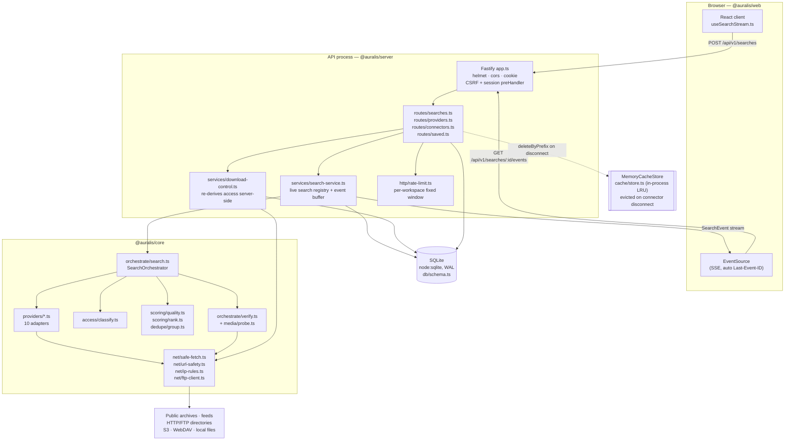

# Architecture overview

Auralis is a universal audio discovery engine: one query, many sources, and a
verdict on every candidate derived from the bytes rather than from the link.
This document describes how the three packages fit together, what happens to a
single search request, and where the deliberate boundaries are.

Everything below is traceable to source. File paths are relative to `auralis/`.

---

## Packages

`auralis/package.json` declares three npm workspaces.

| Package           | Directory         | Owns                                                                                                                                                   |
| ----------------- | ----------------- | ------------------------------------------------------------------------------------------------------------------------------------------------------ |
| `@auralis/core`   | `packages/core`   | Domain model, SSRF-hardened egress, media parsers, provider adapters and registry, orchestration, scoring, dedupe, cache, API contract                 |
| `@auralis/server` | `packages/server` | Fastify API, SSE endpoint, SQLite schema/repositories, connector storage and credential encryption, download control, session handling, fixture origin |
| `@auralis/web`    | `packages/web`    | React 19 client, design system, search stream reducer                                                                                                  |

`@auralis/core` has exactly one runtime dependency (`zod`) and imports
`node:crypto`, `node:dns`, `node:http`, `node:https` and `node:net`
(`net/safe-fetch.ts`, `net/url-safety.ts`, `net/ftp-client.ts`,
`dedupe/fingerprint.ts`, `cache/keys.ts`, `util/ids.ts`). It is a Node package.

### The types-only rule

`packages/web` depends on `@auralis/core`, but the browser bundle must never
pull a runtime value out of it — a `node:dns` import in a Vite bundle is a build
failure at best and a shipped polyfill at worst. The rule is stated and enforced
at the top of `packages/web/src/api/types.ts`:

> `@auralis/core` is a Node package (node:crypto, node:dns, node:http), so the
> browser bundle must never import a runtime value from it. Everything below is
> a type-only import or re-export, which the compiler erases completely.

Consequences of that rule, all visible in the tree:

- `packages/web/src/api/types.ts` contains only `import type` / `export type`.
- Runtime vocabularies the UI needs (enum-like arrays, labels) are **redeclared**
  in `packages/web/src/api/vocabulary.ts` rather than imported.
- `packages/web/tsconfig.json` sets `emitDeclarationOnly: true` with
  `outDir: ./dist-types`; the actual bundle is produced by Vite.
- The wire contract stays single-sourced because both sides refer to the same
  `packages/core/src/api/contract.ts` types.

---

## System shape

---

## Lifecycle of one search request

Real functions, in order.

| #   | Where                                                               | What happens                                                                                                                                                                                                                                                                                                                                                                          |
| --- | ------------------------------------------------------------------- | ------------------------------------------------------------------------------------------------------------------------------------------------------------------------------------------------------------------------------------------------------------------------------------------------------------------------------------------------------------------------------------- |
| 1   | `app.ts` `onRequest` hook                                           | Stamps `x-correlation-id` (`newCorrelationId()`, a UUID) on the reply.                                                                                                                                                                                                                                                                                                                |
| 2   | `app.ts` `preHandler` hook                                          | For `/api/*`: `assertCsrf(request)` requires the `x-auralis-csrf` header on non-GET/HEAD/OPTIONS; `resolveSession(request, reply, …)` reads the signed `auralis_session` cookie, verifies it with `verifySession` (`crypto/secrets.ts`, HMAC-SHA256 + `timingSafeEqual`), and creates a workspace + user on first contact.                                                            |
| 3   | `routes/searches.ts` `POST /api/v1/searches`                        | `context.searchLimiter.assertWithinLimit(workspaceId, 'search')` (`http/rate-limit.ts`), then `createSearchRequestSchema.safeParse(request.body)` (`api/contract.ts`). A schema failure becomes `AuralisError('invalid_request', …)`.                                                                                                                                                 |
| 4   | `services/search-service.ts` `SearchService.create`                 | Caps concurrent searches at `MAX_LIVE_SEARCHES_PER_WORKSPACE = 3`; calls `normalizeQuery` (`query/normalize.ts`); merges `staticProviderConfig` with `connectors.resolveAllByProvider(workspaceId)`; calls `registry.select({ mode, requestedProviderIds, configByProvider, disabledProviderIds, canAttempt })`. Zero selected providers ⇒ `AuralisError('provider_unavailable', …)`. |
| 5   | `db/repositories.ts` `SearchRepository.createSession`               | Inserts the `search_session` row with `status='running'`.                                                                                                                                                                                                                                                                                                                             |
| 6   | `SearchService.create` (returns)                                    | Responds **201** with `CreateSearchResponse`: `searchId`, `mode`, `normalizedQuery`, `providerIds`, `eventsUrl`, `timeBudgetMs` (`budgetFor(mode).totalMs`), `correlationId`. Execution has already started in the background; the client is not made to wait.                                                                                                                        |
| 7   | `SearchService.execute`                                             | Constructs a `SearchOrchestrator` (`orchestrate/search.ts`) and awaits `orchestrator.run(options, emit)`.                                                                                                                                                                                                                                                                             |
| 8   | `SearchOrchestrator.run`                                            | Emits `search_started`, wires an `AbortController` to the caller's signal plus a `setTimeout(… budget.totalMs)`, then `Promise.all(runnable.map(runProvider))`. Providers whose breaker refuses `canAttempt()` are reported as `provider_completed{outcome:'circuit_open'}` and never invoked.                                                                                        |
| 9   | `runProvider` (per provider)                                        | Emits `provider_started`, builds a `SearchContext` with `deadlineMs = start + min(perProviderMs, totalMs)`, iterates `takeUntil(provider.search(...), maxCandidatesPerProvider, signal)` and fires `processCandidate` per item without awaiting it.                                                                                                                                   |
| 10  | `processCandidate`                                                  | Exclusion check → provisional `classifyAccess` → `assemble()` → emits `candidate_discovered` immediately → `verifyCandidate` (or `verifyWithoutUrl` for local/connector assets) → re-`classifyAccess` → `passesFilters` → `DuplicateIndex.add` → emits `candidate_verified` (and `candidate_enriched` for other group members).                                                       |
| 11  | `SearchService.execute` `emit` closure                              | For every event: append to the in-memory ring (`BUFFER_LIMIT = 4000`), `repository.appendEvent` into `search_event`, `repository.saveResult` on discovered/verified/enriched, `repository.deleteResult` on rejected, `repository.recordProviderSearch` on `provider_completed`, then fan out to every subscriber. `isTerminalEvent(event)` flips `search.finished`.                   |
| 12  | `routes/searches.ts` `GET /…/events`                                | The client's `EventSource` connects. `searchService.subscribe(searchId, workspaceId, afterSeq, write)` is called **before** `reply.hijack()`, so an unknown search still returns an ordinary JSON 404 instead of a half-written stream. Buffered events with `seq > afterSeq` replay first, then live events. A `: keep-alive` comment every `SSE_HEARTBEAT_MS = 15_000`.             |
| 13  | `SearchOrchestrator.run` (end)                                      | `finalise()` sorts by `ranking.total` and slices to `budget.maxResults`; emits `search_completed` (or `search_cancelled` / `search_failed`).                                                                                                                                                                                                                                          |
| 14  | `SearchService.execute` (end)                                       | `repository.saveResults` + `repository.finishSession(status, resultCount, partial)`. The live entry is dropped 120 s later so a late client can still replay the buffer.                                                                                                                                                                                                              |
| 15  | `routes/searches.ts` `POST /api/v1/assets/:assetId/download-intent` | `DownloadControlService.createIntent` re-runs `classifyAccess` from the **stored** verification record, re-runs `assertUrlAllowed` on the URL, and writes a `download_audit` row whether or not it allows.                                                                                                                                                                            |

---

## The pipeline, stage by stage

| #   | Stage                        | Implemented in                                                                                                                                                              | Notes                                                                                                                                                                                                                                                                                                                                              |
| --- | ---------------------------- | --------------------------------------------------------------------------------------------------------------------------------------------------------------------------- | -------------------------------------------------------------------------------------------------------------------------------------------------------------------------------------------------------------------------------------------------------------------------------------------------------------------------------------------------- |
| 1   | Input validation             | `api/contract.ts` (`createSearchRequestSchema`, `searchFiltersSchema`), enforced in `routes/searches.ts`; body cap `bodyLimit: 64 * 1024` in `app.ts`; `http/rate-limit.ts` | Strict zod objects. `query` 1–`MAX_QUERY_LENGTH` (256). Duration min ≤ max enforced by a `.refine`.                                                                                                                                                                                                                                                |
| 2   | Query normalisation          | `query/normalize.ts` `normalizeQuery` → `normaliseText`                                                                                                                     | Control bytes stripped, NFKC, lowercase, `._+` → space, smart quotes/dashes folded.                                                                                                                                                                                                                                                                |
| 3   | Intent and entity extraction | `query/normalize.ts` `parseOperators`, `inferIntent`, `splitCreatorTitle`, `buildVariants`                                                                                  | Quoted phrases (≤4), `-term` exclusions (≤8), `filetype:`/`ext:`/`source:`/`provider:`/`bitrate:`/`minbitrate:` operators. Intent ∈ `title \| creator \| creator_title \| filename \| phrase \| general`. Variants capped: `MAX_VARIANTS_QUICK = 2`, `MAX_VARIANTS_DEEP = 5`.                                                                      |
| 4   | Provider selection           | `providers/registry.ts` `ProviderRegistry.select`, driven from `services/search-service.ts`                                                                                 | Skip reasons are explicit: `disabled`, `excluded_by_filter`, `not_in_mode`, `not_configured`, `circuit_open`. `configurationStatus` compares `capabilities.requiredConfiguration` against resolved config.                                                                                                                                         |
| 5   | Parallel provider search     | `orchestrate/search.ts` `runProvider` + `Promise.all`; `orchestrate/limits.ts` `createRateLimiter`, `Semaphore`, `TokenBucket`                                              | Each provider gets its own `AbortController` and `setTimeout(perProviderMs)`.                                                                                                                                                                                                                                                                      |
| 6   | Candidate streaming          | Provider `search(): AsyncIterable<RawSearchCandidate>`; `orchestrate/limits.ts` `takeUntil`                                                                                 | Candidates are processed concurrently; `processCandidate` promises are collected in `inFlight` and awaited at the end of the provider run. Progress is emitted every 5 candidates.                                                                                                                                                                 |
| 7   | URL safety validation        | `net/url-safety.ts` `assertUrlStructurallySafe` → `assertUrlAllowed`; `net/ip-rules.ts` `classifyIp`                                                                        | Scheme, length (≤2048), control characters, embedded credentials, denied hostnames/TLDs, allow/deny host lists, port allow-list, then DNS with per-address classification.                                                                                                                                                                         |
| 8   | Redirect resolution          | `net/safe-fetch.ts` (the `for(;;)` loop in `createSafeFetch`)                                                                                                               | Every hop re-enters `assertUrlAllowed`. `maxRedirects: 4`. Credential headers dropped when the host changes. 303, and 302-on-POST, downgrade to GET.                                                                                                                                                                                               |
| 9   | Header inspection            | `orchestrate/verify.ts` step 1                                                                                                                                              | HEAD, capped at `min(remaining, 5_000)` ms. Records `content-length`, `content-type`, `accept-ranges`. A source that refuses HEAD is not penalised.                                                                                                                                                                                                |
| 10  | Partial content probe        | `orchestrate/verify.ts` steps 2 and 4                                                                                                                                       | Head range `0..HEAD_SAMPLE_BYTES-1` (64 KiB); optional tail range of `TAIL_SAMPLE_BYTES` (32 KiB), skipped in quick mode (`fetchTail: mode !== 'quick'`). Byte caps are enforced in `safe-fetch.ts` on the `data` handler, not by trusting `content-length`. Playlist detection (`media/playlist.ts` `detectPlaylistFormat`) runs between the two. |
| 11  | Media signature verification | `media/signatures.ts` `detectNonAudio`, `detectAudioSignature`, called from `media/probe.ts`                                                                                | Non-audio magic (MZ, ELF, Mach-O, ZIP, gzip, PDF, PNG, JPEG, HTML, XML) ⇒ `not_audio`. Audio magic ⇒ `SignatureMatch` with a `strong` flag; only strong matches with no corruption signals reach `verified_audio`.                                                                                                                                 |
| 12  | Metadata extraction          | `media/probe.ts` + `media/parsers/{mp3,flac,riff,mp4,ogg,id3}.ts`                                                                                                           | Pure, synchronous. Also cross-checks extension and declared MIME against the signature and records `mismatch:` / `agreement:` evidence.                                                                                                                                                                                                            |
| 13  | Access classification        | `access/classify.ts` `classifyAccess`                                                                                                                                       | Runs twice per candidate: provisionally before verification and authoritatively after. Re-run a third time server-side by `services/download-control.ts`.                                                                                                                                                                                          |
| 14  | Duplicate detection          | `dedupe/fingerprint.ts` `computeFingerprints`, `dedupe/group.ts` `DuplicateIndex`                                                                                           | Nine progressively weaker keys. Authoritative levels merge alone; weaker levels need `CORROBORATION_REQUIRED = 2`. The leader can be replaced when a better copy arrives.                                                                                                                                                                          |
| 15  | Quality scoring              | `scoring/quality.ts` `scoreQuality`                                                                                                                                         | Nine weighted factors with a published breakdown and user-facing warnings. A lossy file is capped at 0.92 on the format factor so it can never equal a lossless original.                                                                                                                                                                          |
| 16  | Relevance ranking            | `scoring/rank.ts` `scoreRanking` (using `scoring/relevance.ts`)                                                                                                             | Fourteen weighted factors. Non-leader duplicates are multiplied by 0.6 so a mirror stays visible but never outranks its leader.                                                                                                                                                                                                                    |
| 17  | Progressive UI delivery      | `routes/searches.ts` SSE handler; buffering in `services/search-service.ts`; `packages/web/src/hooks/useSearchStream.ts`                                                    | Events are keyed by `result.id` in the client reducer, so `discovered → verified → enriched` replaces in place. The client buffers into a ref and flushes once per animation frame.                                                                                                                                                                |

---

## Boundaries, and why they exist

### One egress path

`net/safe-fetch.ts` `createSafeFetch` is the only function in the system that
builds an outbound HTTP request. Providers never see the global `fetch`; they
receive `context.fetch: SafeFetchFn` on `SearchContext`, and
`domain/provider.ts` states the rule in the interface docblock: _"never perform
their own network I/O outside `context.fetch`"_.

Three things enforce it rather than merely document it:

- `eslint.config.js` `NETWORK_RESTRICTIONS` bans `fetch(...)`,
  `globalThis.fetch`, `axios` and `node-fetch` everywhere, with an exception
  only for `packages/core/src/net/**`.
- The lint config's docblock also points at an edit-time
  `.claude/hooks/network-guard.sh`. That hook file is **not present** in the
  tree today, so ESLint is the only mechanical enforcement currently running.
- `net/url-safety.ts` carries the invariant in its header: _"no other module in
  Auralis is permitted to build an outbound request from a URL that has not
  passed through `assertUrlAllowed`."_

The FTP adapter is the one non-HTTP protocol, and `net/ftp-client.ts` reuses the
same primitives: the control target goes through the URL safety service, and the
address returned in the PASV reply is re-classified with `classifyIp` before the
data connection is opened.

Why a single path: the guarantees in `safe-fetch.ts` — IP pinning, post-connect
peer re-check, byte caps, redirect revalidation, credential stripping — are only
guarantees if there is no second way out of the process.

### One access-classification authority

`access/classify.ts` `classifyAccess` is the only function permitted to decide
that a result is downloadable. `domain/access.ts` frames the vocabulary
(`ACCESS_CLASSIFICATIONS`, `DOWNLOADABLE_CLASSIFICATIONS`,
`PRIVATE_CLASSIFICATIONS`), and the function is deliberately monotonic in one
direction: `mostRestrictive()` lets a provider declare something _more_
restrictive than the evidence supports, but no provider claim can upgrade a
candidate past its verification evidence.

The API does not trust the client's copy. `services/download-control.ts`
`createIntent` re-reads the stored result, re-runs `classifyAccess` with
`credentialsValid` recomputed from the current connector state, requires
`verification.status ∈ {verified_audio, probable_audio}`, and re-runs
`assertUrlAllowed` on the URL before returning it. Every attempt — allowed or
denied — writes a `download_audit` row.

Two related consequences fall out of the same authority:

- `orchestrate/search.ts` `assemble()` sets
  `mediaUrl: exposeMediaUrl ? candidate.mediaUrl : null`, where `exposeMediaUrl`
  is `access.actions.includes('copy_direct_url')`. A restricted asset's direct
  URL never reaches the client at all.
- `cache/keys.ts` `buildProviderKey` throws `CacheScopeViolationError` rather
  than produce a `shared:` key for a provider with `producesPrivateResults`.
  (No read/write path uses the cache yet — see ADR 0007 — so this guarantee is
  currently protecting a route nobody takes.)

### Pure, synchronous media parsers

`media/probe.ts` and everything under `media/parsers/` take `Uint8Array` in and
return plain objects out. No I/O, no async, no globals. `probe.ts` says why:
_"Everything here is pure and synchronous so it can run inside an isolated
worker."_

The practical payoffs:

- The same parser code verifies a network candidate (`orchestrate/verify.ts`)
  and a local file (`app.ts` `verifyWithoutUrl`, via `readLocalSample`), so the
  evidence strings from both paths are directly comparable.
- Parsing a hostile file cannot escalate into a network call or a filesystem
  read, because the parser has no way to make one.
- Tests are fixture-in/assert-out (`core/src/testing/media-fixtures.ts`), with no
  network in the default suite.

The cost is stated plainly in ADR 0003: the parsers read containers, they do not
decode audio, and they cover exactly MP3, WAV, AIFF, FLAC, M4A/ALAC, AAC,
Ogg Vorbis and Opus.

---

## Commands

From `auralis/package.json`. Node ≥ 22.6 is required (`engines`).

| Command                           | What it does                                                                                                 |
| --------------------------------- | ------------------------------------------------------------------------------------------------------------ |
| `npm run dev`                     | `node scripts/dev.mjs` — API (5175), Vite client (5174), fixture origin (5176)                               |
| `npm run build`                   | Builds core, then server, then web                                                                           |
| `npm start`                       | `node --experimental-sqlite packages/server/dist/main.js`                                                    |
| `npm run db:migrate`              | `node --experimental-sqlite packages/server/dist/db/migrate-cli.js` — migrations **and** the retention prune |
| `npm run fixtures:serve`          | Fixture origin only                                                                                          |
| `npm run typecheck`               | `tsc -b packages/core packages/server packages/web`                                                          |
| `npm run lint` / `lint:fix`       | ESLint, including the egress restrictions                                                                    |
| `npm run format` / `format:check` | Prettier                                                                                                     |
| `npm test` / `test:watch`         | Vitest (no network beyond loopback)                                                                          |
| `npm run test:live`               | `AURALIS_LIVE_TESTS=1`, opt-in, hits real services                                                           |
| `npm run e2e` / `e2e:install`     | Playwright                                                                                                   |
| `npm run audit`                   | `npm audit --omit=dev --audit-level=high`                                                                    |
| `npm run verify`                  | The release gate: format, lint, types, tests, build, e2e                                                     |

---

## Related documents

- [`../adr/`](../adr/) — the seven architecture decision records
- [`../security/source-access-policy.md`](../security/source-access-policy.md)
- [`../security/threat-model.md`](../security/threat-model.md)
- [`../providers/`](../providers/) — per-provider setup
- [`data-model.md`](./data-model.md), [`search-pipeline.md`](./search-pipeline.md)
