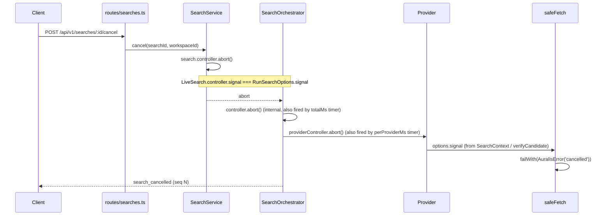
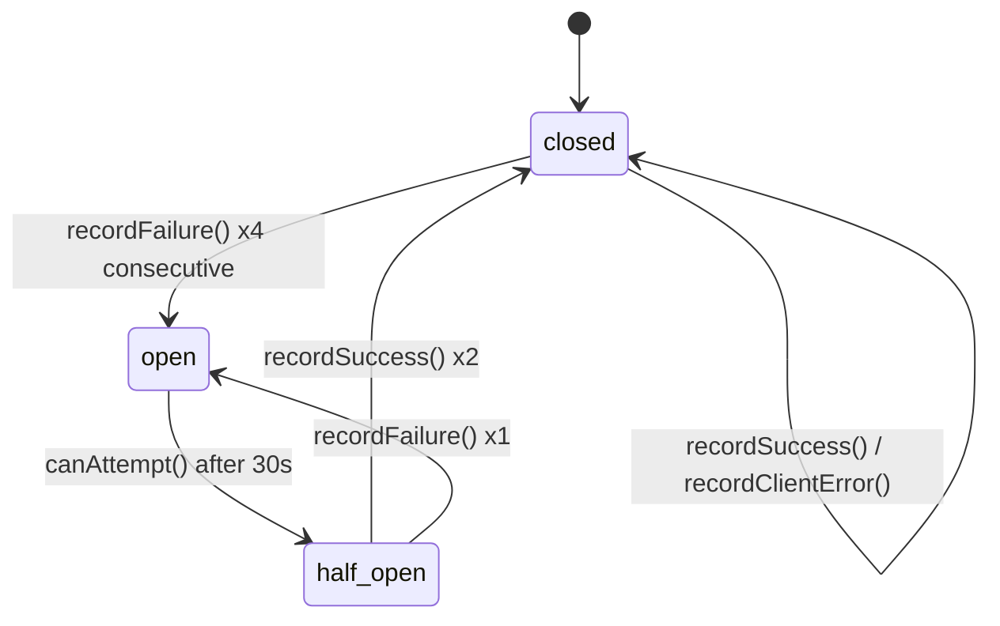

# Search pipeline

How a query becomes a stream of verified results: the provider contract, the
event contract, the budgets, and what happens when something goes wrong.

Sources: `packages/core/src/domain/provider.ts`,
`packages/core/src/domain/events.ts`, `packages/core/src/orchestrate/*.ts`,
`packages/core/src/providers/{registry,helpers,index}.ts`,
`packages/server/src/routes/searches.ts`,
`packages/server/src/services/search-service.ts`,
`packages/web/src/hooks/useSearchStream.ts`.

---

## The provider contract

Every source — public API, RSS feed, HTTP or FTP directory listing, local
folder, authenticated connector — implements exactly this and nothing else
(`domain/provider.ts`):

```ts
interface SearchProvider {
  readonly id: string;
  readonly displayName: string;
  readonly capabilities: ProviderCapabilities;
  search(
    query: NormalizedSearchQuery,
    context: SearchContext,
    signal: AbortSignal,
  ): AsyncIterable<RawSearchCandidate>;
  healthCheck(context: ProviderHealthContext): Promise<ProviderHealth>;
}
```

The four obligations are stated in the interface docblock:

1. stream candidates as they are found (yield early, yield often)
2. honour `signal` and `context.deadlineMs`
3. never perform network I/O outside `context.fetch`
4. never make access decisions beyond declaring a conservative starting point

`search` returns an `AsyncIterable`, not an array, because the orchestrator has
to be able to act on candidate #1 while the provider is still looking for #2.
`healthCheck` is separate so the diagnostics page can report a source without
running a search.

Registration is explicit: `createDefaultRegistry` in `providers/index.ts`
registers ten adapters, each with a `setupDocPath`, its `secretConfigKeys`, and
an `enabledByDefault` flag. `ZERO_CONFIG_PROVIDER_IDS` names the three that run
with no configuration: `internet-archive`, `wikimedia-commons`, `librivox`.

### `SearchContext`

Handed to `search()`. Providers get what they need and nothing else — no raw
HTTP request, no cookies, no other tenant's data.

| Field           | Type                     | Supplies                                                                                                                                                                     |
| --------------- | ------------------------ | ---------------------------------------------------------------------------------------------------------------------------------------------------------------------------- |
| `searchId`      | `string`                 | Correlates provider logs with the search                                                                                                                                     |
| `workspaceId`   | `string`                 | The tenant; used for scoping, never for filtering results after the fact                                                                                                     |
| `mode`          | `SearchMode`             | `quick` / `deep` / `connected`; adapters use it to widen page size and traversal depth                                                                                       |
| `deadlineMs`    | `number`                 | **Absolute** wall-clock deadline: `providerStartedAt + min(budget.perProviderMs, budget.totalMs)`. Adapters read it through `msRemaining(context)` in `providers/helpers.ts` |
| `maxCandidates` | `number`                 | `budget.maxCandidatesPerProvider`; the orchestrator also enforces it independently via `takeUntil`                                                                           |
| `config`        | `Record<string, string>` | Resolved and **decrypted** configuration for this provider in this workspace                                                                                                 |
| `logger`        | `ProviderLogger`         | `providerLogger(logger, provider.id)` — a child logger tagged with the provider id                                                                                           |
| `fetch`         | `SafeFetchFn`            | The SSRF-hardened client. _"Providers must not use global fetch."_                                                                                                           |
| `now`           | `() => number`           | Injectable clock, so deadline behaviour is testable                                                                                                                          |

`SafeFetchOptions` bounds every call: `method` (`GET`/`HEAD`/`POST`/`PROPFIND`),
`headers`, `body`, `signal`, `timeoutMs`, `maxBytes`, `range`, and an optional
`allowHosts` narrowing. `SafeFetchResponse` returns `finalUrl`, `finalHost`,
`finalIp`, `redirectCount`, `truncated` and `durationMs` alongside the body, so
callers can record what actually happened rather than what they asked for.

### `ProviderCapabilities`

Capabilities drive selection, query shaping and UI affordances _without calling
the provider_. Defaults come from `capabilities(overrides)` in
`providers/helpers.ts`.

| Field                          | Default                                          | What it controls                                                                                                                                                              |
| ------------------------------ | ------------------------------------------------ | ----------------------------------------------------------------------------------------------------------------------------------------------------------------------------- |
| `supportsTextSearch`           | `true`                                           | Whether the adapter can take free text at all                                                                                                                                 |
| `supportsExactTitleSearch`     | `false`                                          | Whether an exact-title query can be pushed down rather than filtered client-side                                                                                              |
| `returnsDirectMediaUrls`       | `false`                                          | **Downgrades access.** `classifyAccess` turns `direct_download` into `source_download` when this is false (`capability:provider-does-not-publish-direct-urls`)                |
| `supportsPreview`              | `false`                                          | Gates the `preview` action, and is the fallback classification when bytes are not retrievable (`preview_only` vs `metadata_only`)                                             |
| `requiresAuthentication`       | `false`                                          | Feeds `credentialsValid` in `classifyAccess`; adds the `request_credentials` action for `restricted`; surfaced as `ProviderSummary.requiresAuthentication`                    |
| `rateLimit`                    | `{ kind: 'concurrency_only', maxConcurrent: 2 }` | Chooses the limiter built by `createRateLimiter`: `none`, `fixed_window`, `token_bucket` or `concurrency_only`                                                                |
| `robotsPosture`                | `'api_terms_only'`                               | Declared crawling posture: `not_applicable`, `respects_robots`, `api_terms_only`, `user_configured`                                                                           |
| `timeoutMs`                    | `8_000`                                          | The adapter's own per-request ceiling: adapters call `timeoutMs: Math.min(msRemaining(context), this.capabilities.timeoutMs)`                                                 |
| `retry`                        | `DEFAULT_RETRY_POLICY`                           | Declared retry intent (3 attempts, 250 ms base, 4 s cap, jitter, retryable `408 425 429 500 502 503 504`). **Not consumed by any current code path** — see "Failure handling" |
| `cacheable`                    | `true`                                           | Whether provider results may be cached at all                                                                                                                                 |
| `exposesFileSize`              | `false`                                          | Whether the source declares a size (a claim, cross-checked against the probe)                                                                                                 |
| `exposesDuration`              | `false`                                          | Same for duration; also feeds `providerResponseQuality` in ranking (`0.9` when true, `0.6` when false)                                                                        |
| `exposesBitrate`               | `false`                                          | Same for bitrate                                                                                                                                                              |
| `supportsServerSideSearch`     | `true`                                           | Whether filtering happens at the source or locally                                                                                                                            |
| `supportsPagination`           | `false`                                          | Whether more than one page can be requested                                                                                                                                   |
| `supportsIncrementalStreaming` | `false`                                          | Whether the adapter really yields as it goes rather than collecting first                                                                                                     |
| `maxConcurrentRequests`        | `2`                                              | Capacity of the `Semaphore` inside the adapter's rate limiter                                                                                                                 |
| `sourceCategory`               | `'unknown'`                                      | Drives `SOURCE_TRUST` in quality scoring, and `isUserOwned` (`sourceCategory === 'local_files'`) in access classification                                                     |
| `modes`                        | `['quick', 'deep']`                              | Modes in which the registry may select this provider                                                                                                                          |
| `producesPrivateResults`       | `false`                                          | **Two hard consequences:** `isConnectorResult` in `classifyAccess`, and `buildProviderKey` refusing to emit a `shared:` cache key                                             |
| `requiredConfiguration`        | `[]`                                             | Keys that must be non-blank before `configurationStatus` returns `ready`                                                                                                      |

Example (`providers/internet-archive.ts`): `supportsExactTitleSearch: true`,
`returnsDirectMediaUrls: true`, `supportsPreview: true`,
`rateLimit: { kind: 'token_bucket', capacity: 8, refillPerSec: 2 }`,
`timeoutMs: 12_000`, `maxConcurrentRequests: 3`,
`sourceCategory: 'open_archive'`, `modes: ['quick', 'deep']`.

### Provider selection

`ProviderRegistry.select` walks every registration in order and records an
explicit skip reason. Nothing is silently dropped.

| Check                                         | Skip reason          |
| --------------------------------------------- | -------------------- |
| `disabledProviderIds.has(id)`                 | `disabled`           |
| user restricted providers and this is not one | `excluded_by_filter` |
| `!capabilities.modes.includes(mode)`          | `not_in_mode`        |
| `configurationStatus(id, config) !== 'ready'` | `not_configured`     |
| `!canAttempt(id)` (breaker)                   | `circuit_open`       |

`statusForSkipReason` maps those onto the `ProviderStatus` shown on the
diagnostics page, so a `not_configured` provider appears as such rather than
vanishing.

---

## The search event contract

`domain/events.ts`. Eleven event types, one discriminated union, streamed as
SSE.

Every event carries `BaseEvent`: `schemaVersion`, `searchId`, `seq`, `at`.

| Type                   | Payload beyond `BaseEvent`                                                                                                                |
| ---------------------- | ----------------------------------------------------------------------------------------------------------------------------------------- |
| `search_started`       | `mode`, `normalizedQuery`, `providerIds[]`, `timeBudgetMs`                                                                                |
| `provider_started`     | `providerId`, `providerDisplayName`                                                                                                       |
| `provider_completed`   | `providerId`, `outcome`, `candidateCount`, `durationMs`, `message \| null`                                                                |
| `candidate_discovered` | `providerId`, `result: SearchResult`                                                                                                      |
| `candidate_verified`   | `result: SearchResult`                                                                                                                    |
| `candidate_enriched`   | `result: SearchResult`                                                                                                                    |
| `candidate_rejected`   | `providerId`, `candidateId`, `reason`, `detail \| null`                                                                                   |
| `search_progress`      | `providersTotal`, `providersCompleted`, `candidatesDiscovered`, `candidatesVerified`, `candidatesRejected`, `resultsVisible`, `elapsedMs` |
| `search_completed`     | `resultCount`, `durationMs`, `partial`, `degradedProviderIds[]`                                                                           |
| `search_cancelled`     | `reason: 'client_request' \| 'timeout' \| 'shutdown'`                                                                                     |
| `search_failed`        | `code`, `message`                                                                                                                         |

`ProviderOutcome` ∈ `ok`, `empty`, `timeout`, `rate_limited`, `error`,
`cancelled`, `circuit_open`, `not_configured`, `auth_required`.

`RejectionReason` ∈ `unsafe_url`, `not_audio`, `duplicate`, `excluded_term`,
`filter_mismatch`, `probe_failed`, `oversized`, `playlist_unresolved`.

`provider_completed.message` is documented as _"Safe, user-facing message. Never
contains internal diagnostics."_ — the orchestrator only ever assigns literal
strings or `AuralisError.publicMessage`.

### Ordering guarantees

| Guarantee                                                            | Mechanism                                                                                                                                                                                                                                                                                                                                       |
| -------------------------------------------------------------------- | ----------------------------------------------------------------------------------------------------------------------------------------------------------------------------------------------------------------------------------------------------------------------------------------------------------------------------------------------- |
| **`seq` increases monotonically by 1**                               | `SearchOrchestrator.run` closes over `let seq = 0` and every event is built through `base()`, which calls `nextSeq()`. There is exactly one emitter per search.                                                                                                                                                                                 |
| **Discovery precedes verification for a given result**               | `processCandidate` emits `candidate_discovered` synchronously after the first `assemble()`, before it awaits any probe. `candidate_verified` is emitted at the end of the same function. Both use the same `id` from `deterministicId('res', provider.id, candidate.providerAssetId)`.                                                          |
| **A rejected candidate is never verified**                           | Every rejection path (`excluded_term`, `not_audio`, `playlist_unresolved`, `unsafe_url`, `filter_mismatch`) does `results.delete(id)` and `return`s before reaching the `candidate_verified` emit.                                                                                                                                              |
| **`provider_started` precedes that provider's `provider_completed`** | Both are emitted inside `runProvider`, first line and last lines.                                                                                                                                                                                                                                                                               |
| **Exactly one terminal event**                                       | `TERMINAL_EVENT_TYPES = { search_completed, search_cancelled, search_failed }`. `run()` emits `search_cancelled` **or** `search_completed` on the success path (mutually exclusive branches, each followed by `return`), and `search_failed` from the single `catch`. `isTerminalEvent` is what flips `LiveSearch.finished` in `SearchService`. |

Not guaranteed, deliberately: relative order **between** providers, and relative
order of `candidate_*` events across candidates. Providers run under
`Promise.all` and `processCandidate` calls are not awaited in sequence. The
client reducer is written for this — `useSearchStream.ts` keys results by
`result.id` so a later event for the same id replaces the earlier one.

### Versioning

`SEARCH_EVENT_SCHEMA_VERSION = 1`, stamped onto every event as `schemaVersion`.
The rule is in the file header:

> Adding a field is a minor change; removing or repurposing one is a breaking
> change and requires bumping `SEARCH_EVENT_SCHEMA_VERSION`.

So a **breaking change** is any of: removing an event type or a field; changing
a field's type or meaning; removing a member from `SearchEventType`,
`ProviderOutcome` or `RejectionReason`; or changing the ordering guarantees
above. Adding an event type, a field, or a new enum member that consumers
already treat as opaque is not.

The API path is versioned separately: `API_VERSION = 'v1'`,
`API_BASE_PATH = '/api/v1'` in `api/contract.ts`. The cache has its own
`CACHE_SCHEMA_VERSION = 1` mixed into every digest in `cache/keys.ts`, so a
change in what a key means invalidates rather than mis-serves.

---

## Time budgets and concurrency

`orchestrate/limits.ts`, `BUDGET_TABLE`. `budgetFor(mode)` never returns
undefined — an unrecognised mode falls back to `quick`.

| Budget field               | `quick` | `deep` | `connected` |
| -------------------------- | ------: | -----: | ----------: |
| `totalMs`                  |  12 000 | 45 000 |      25 000 |
| `perProviderMs`            |   6 000 | 20 000 |      15 000 |
| `perVerificationMs`        |   4 000 |  8 000 |       6 000 |
| `maxCandidatesPerProvider` |      25 |     80 |         100 |
| `maxVerifications`         |      30 |    140 |          80 |
| `maxResults`               |     120 |    400 |         300 |
| `verificationConcurrency`  |       6 |      8 |           4 |

How each is applied:

| Bound                      | Enforcement                                                                                                                                                                                                                         |
| -------------------------- | ----------------------------------------------------------------------------------------------------------------------------------------------------------------------------------------------------------------------------------- |
| `totalMs`                  | `setTimeout(() => controller.abort(), budget.totalMs)` in `run()`. Reported to the client as `CreateSearchResponse.timeBudgetMs` and in `search_started.timeBudgetMs`.                                                              |
| `perProviderMs`            | Two mechanisms per provider: `context.deadlineMs = providerStartedAt + min(perProviderMs, totalMs)` (cooperative, read by adapters via `msRemaining`) **and** `setTimeout(() => providerController.abort(), perProviderMs)` (hard). |
| `perVerificationMs`        | Passed as `timeoutMs` to `verifyCandidate`, which subdivides it: HEAD gets `min(remaining, 5_000)`, the head range gets `remaining()`, the tail range needs `remaining() > 500` to be attempted at all.                             |
| `maxCandidatesPerProvider` | `takeUntil(stream, budget.maxCandidatesPerProvider, signal)` — a generator that stops pulling. Also passed to the adapter as `context.maxCandidates`.                                                                               |
| `maxVerifications`         | Search-wide counter `verificationsUsed`; `shouldVerify` requires `verificationsUsed < budget.maxVerifications`. Candidates beyond the cap stay `unverified` and therefore are not downloadable.                                     |
| `verificationConcurrency`  | `new Semaphore(budget.verificationConcurrency)`; `processCandidate` acquires a slot before probing and releases it in a `finally`.                                                                                                  |
| `maxResults`               | `finalise()` sorts by `ranking.total` descending and slices.                                                                                                                                                                        |

Beyond the budget table:

- **Concurrent searches per workspace**: `MAX_LIVE_SEARCHES_PER_WORKSPACE = 3`
  in `SearchService.create`, else `rate_limited`.
- **Requests per minute**: `AURALIS_RATE_LIMIT_SEARCHES_PER_MINUTE` (default 20)
  and `..._DOWNLOADS_PER_MINUTE` (default 40), keyed by workspace in
  `http/rate-limit.ts`.
- **Event buffer**: `BUFFER_LIMIT = 4000` events held in memory per search.
- **Egress caps** (`PRODUCTION_URL_POLICY`): `maxRedirects: 4`,
  `maxResponseBytes: 2 MiB`, `connectTimeoutMs: 5_000`, `totalTimeoutMs: 15_000`.
  A `SafeFetchOptions.timeoutMs` or `maxBytes` can only narrow these, never widen
  them (`Math.min` in `createSafeFetch`).
- **Probe sample sizes**: `HEAD_SAMPLE_BYTES = 64 KiB`,
  `TAIL_SAMPLE_BYTES = 32 KiB`.
- **Query variants**: 2 in quick/connected, 5 in deep — _"Every extra variant
  multiplies provider load, so the cap is a rate-limit protection, not a
  nicety."_

### An honest note on the rate limiter

`createRateLimiter` is called **inside** `runProvider`, so the returned
`TokenBucket` is constructed fresh for each provider run and starts full. The
single `limiter.tryConsume()` at the top therefore effectively always succeeds,
which makes the `rate_limited` outcome from that branch unreachable in practice.
`limiter.acquire()` — the semaphore that would apply `maxConcurrentRequests` —
is never called by the orchestrator at all; adapters bound their own concurrency
by how they iterate. The limiter machinery is real and tested; it is simply not
yet wired to a per-provider persistent instance.

---

## Cancellation

There are three abort signals in play, chained.



| Hop                     | Code                                                                                                                                                                                                                              |
| ----------------------- | --------------------------------------------------------------------------------------------------------------------------------------------------------------------------------------------------------------------------------- |
| HTTP → service          | `POST /api/v1/searches/:searchId/cancel` → `SearchService.cancel`, which checks `search.workspaceId === workspaceId`, then `search.controller.abort()`. Returns **202** with `cancelled: true/false`.                             |
| Service → orchestrator  | `LiveSearch.controller.signal` is passed straight into `RunSearchOptions.signal`.                                                                                                                                                 |
| Orchestrator fan-out    | `options.signal.addEventListener('abort', abortAll, { once: true })` aborts the orchestrator's own `controller`. The same `controller` is aborted by the `totalMs` deadline timer.                                                |
| Orchestrator → provider | Each `runProvider` creates a `providerController`; `controller.signal.addEventListener('abort', () => providerController.abort())`. The provider receives `providerController.signal` as its third argument and inside `context`. |
| Orchestrator → probe    | `verifyCandidate` receives `signal: controller.signal` — the orchestrator-wide one, so cancelling the search kills in-flight probes even for providers that already finished yielding.                                            |
| Probe → socket          | `performRequest` registers `externalSignal.addEventListener('abort', onAbort)`; `onAbort` calls `failWith(new AuralisError('cancelled', …))`, which clears the timer, removes the listener and `req.destroy()`s the request.      |
| Semaphore               | `Semaphore.acquire(signal)` removes its waiter from the queue and rejects with `aborted` rather than leaving a dangling promise.                                                                                                  |
| Iteration               | `takeUntil` checks `signal.aborted` on each item and returns, so a provider that keeps yielding stops being drained.                                                                                                              |

Cancellation is treated as an expected outcome, not an error. `processCandidate`
returns silently on `AuralisError('cancelled')`; `runProvider` maps it to
`outcome: 'cancelled'`; `verifyCandidate` rethrows it rather than recording a
failed verification.

Two additional exits:

- **Client disconnect**: the SSE handler wires `cleanup` to `request.raw`
  `close`/`error` and `stream` `error`. `cleanup` clears the heartbeat and
  unsubscribes — but does **not** abort the search. A disconnected client can
  reconnect and replay.
- **Process shutdown**: `app.addHook('onClose', …)` calls
  `searchService.shutdown()`, which aborts every unfinished search and awaits
  `Promise.allSettled([...this.running])` before `db.close()`, so the database is
  never closed underneath a search that is still writing.

Two caveats worth knowing:

- `search_cancelled.reason` is **always** `'client_request'` in the current
  orchestrator. The `'timeout'` and `'shutdown'` variants are in the type but
  never emitted.
- A `totalMs` timeout aborts the orchestrator's internal `controller`, not
  `options.signal`. So the search ends with
  `search_completed { partial: true }`, not `search_cancelled`. That is
  deliberate — the results gathered so far are real — but it means "the budget
  ran out" and "some providers were degraded" are reported through the same
  `partial` flag.

---

## Failure handling

### Circuit breaker

`orchestrate/breaker.ts`. One `CircuitBreaker` per provider id, held in a
`CircuitBreakerRegistry` constructed once in `app.ts` with no options, so all
defaults apply.

| Parameter          | Default | Meaning                                                                |
| ------------------ | ------: | ---------------------------------------------------------------------- |
| `failureThreshold` |       4 | Consecutive failures before the circuit opens                          |
| `successThreshold` |       2 | Consecutive successes in `half_open` before it closes                  |
| `openDurationMs`   |  30 000 | How long `open` lasts before `canAttempt()` promotes it to `half_open` |

State machine:



`recordFailure()` from `half_open` re-opens immediately — one probe is enough to
say "still broken". `recordClientError()` resets `consecutiveFailures` to 0 and
never changes state.

The registry is consulted in two places: `SearchService.create` passes
`canAttempt` into `registry.select` (so an open provider is not even selected),
and `run()` re-filters with `breaker.canAttempt()` and emits
`provider_completed { outcome: 'circuit_open', message: 'This source is
temporarily unavailable.' }` for anything it drops.

### What never opens the circuit

```ts
const DETERMINISTIC_CLIENT_STATUSES = new Set([
  400, 401, 403, 404, 405, 406, 409, 410, 414, 415, 422,
]);
```

These mean _"the request was wrong"_, not _"the provider is down"_. In
`runProvider`, when an `AuralisError` carries `details.status`, the orchestrator
calls `breaker.recordClientError()` for these and `breaker.recordFailure()` for
everything else. Rationale: a malformed query or a missing item is not evidence
about the source's health, and letting it open the circuit would take a working
provider offline for 30 seconds because one user typed something odd.

`isRetryableStatus` applies the same filter to retry decisions —
`isDeterministicClientError(status)` short-circuits to `false` before the
policy's `retryableStatuses` list is even consulted.

### Backoff

`backoffDelayMs(attempt, baseDelayMs, maxDelayMs, jitter, random)` implements
exponential backoff with **full** jitter:

```
exponential = min(maxDelayMs, baseDelayMs * 2^(attempt-1))
delay       = jitter ? round(random() * exponential) : exponential
```

Full jitter (uniform over `[0, exponential]`) rather than a fixed backoff is
what stops a fleet of retries re-synchronising into a thundering herd against a
source that just came back.

**Current status, stated plainly:** `backoffDelayMs` and `isRetryableStatus` are
exported and unit-testable but are not called from the orchestrator, from
`safe-fetch.ts`, or from any adapter, and `ProviderCapabilities.retry` is
declared but never read. Today a failed provider request is a failed provider
request; the retry machinery is present and correct but unwired.

### Outcome mapping in `runProvider`

| Condition                                     | Outcome        | Breaker                                      | Message to the user                       |
| --------------------------------------------- | -------------- | -------------------------------------------- | ----------------------------------------- |
| stream completed, ≥1 candidate                | `ok`           | `recordSuccess()`                            | `null`                                    |
| stream completed, 0 candidates                | `empty`        | `recordSuccess()`                            | `null`                                    |
| `providerController` aborted but search not   | `timeout`      | `recordFailure()`                            | "This source did not respond in time."    |
| search-wide `controller` aborted              | `cancelled`    | —                                            | `null`                                    |
| `AuralisError` with `code === 'rate_limited'` | `rate_limited` | client-error or failure, by `details.status` | `error.publicMessage`                     |
| other `AuralisError`                          | `error`        | client-error or failure, by `details.status` | `error.publicMessage`                     |
| non-Auralis throw                             | `error`        | `recordFailure()`                            | "This source could not be searched."      |
| breaker already open at selection             | `circuit_open` | —                                            | "This source is temporarily unavailable." |

### Degraded, not hidden

The core principle: a source that failed is _reported_, never quietly omitted.

- Any outcome other than `ok` or `empty` pushes the provider id onto `degraded`.
- `search_completed` carries `degradedProviderIds: [...new Set(degraded)]` and
  `partial: degraded.length > 0 || controller.signal.aborted`.
- `partial` is persisted onto `search_session.partial` and returned by
  `GET /api/v1/searches/:id`.
- Every provider run — success or failure — writes a `provider_search` row with
  its outcome, candidate count and duration.
- `provider_completed` is emitted for skipped-by-breaker providers too, so the
  UI's provider list never contains a row stuck on "searching".
- The client keeps a `ProviderRun` per provider whose state is
  `'pending' | 'searching' | ProviderOutcome`, and `SearchSession` exposes
  `partial` and `degradedProviderIds` directly.
- `GET /api/v1/providers/health` reports `status`, `message`, `latencyMs`,
  `circuitState` and `setupDocPath` per provider; a health check that throws
  becomes `status: 'unavailable'` with "The health check did not complete."
  rather than a 500.

Errors that cross the API boundary are mapped through `AuralisError`
(`domain/errors.ts`): sixteen codes, each with a fixed HTTP status, a
`publicMessage` and structured non-sensitive `details`. `app.ts`
`setErrorHandler` logs internal detail and returns `toPublicJSON(correlationId)`
— stack traces and raw messages never reach the client.

---

## Progressive delivery over SSE

### Wire format

`routes/searches.ts`, `GET /api/v1/searches/:searchId/events`:

```
id: <event.seq>
event: <event.type>
data: <JSON.stringify(event)>

```

Response head, written directly to the raw socket:

| Header                   | Value                              | Why                                                  |
| ------------------------ | ---------------------------------- | ---------------------------------------------------- |
| `content-type`           | `text/event-stream; charset=utf-8` | Otherwise the browser refuses the stream             |
| `cache-control`          | `no-cache, no-transform`           |                                                      |
| `connection`             | `keep-alive`                       |                                                      |
| `x-accel-buffering`      | `no`                               | Disables buffering in reverse proxies that honour it |
| `x-content-type-options` | `nosniff`                          |                                                      |

Three ordering details in that handler that exist for real reasons, each
commented in the source:

1. `subscribe(...)` is called **before** `reply.hijack()`, so an unknown search
   id returns an ordinary JSON 404 instead of a half-written event stream.
2. Events that arrive between subscribing and writing the head are pushed onto
   `pending` and flushed only once `streaming = true`, so nothing is emitted
   before the headers.
3. Writing to `reply.raw` bypasses Fastify's serialiser, so the head has to be
   written by hand.

A `: keep-alive\n\n` comment every `SSE_HEARTBEAT_MS = 15_000` stops idle
intermediaries closing the connection. When the search is already finished at
subscribe time, the handler writes
`event: stream_closed\ndata: {"reason":"search_finished"}` and ends — note that
`stream_closed` is a transport-level frame, not a member of `SearchEvent`.

### Replay via `Last-Event-ID`

```ts
const lastEventId = Number.parseInt(
  String(request.headers['last-event-id'] ?? '0'),
  10,
);
const afterSeq =
  Number.isFinite(lastEventId) && lastEventId > 0 ? lastEventId : 0;
```

Because the `id:` field of every frame is `event.seq`, and `seq` is a dense
monotonic counter, `Last-Event-ID` is directly usable as a cursor. The browser's
`EventSource` sends it automatically on reconnect — the client
(`useSearchStream.ts`) constructs a plain `new EventSource(created.eventsUrl)`
and does not manage the header itself.

`SearchService.subscribe(searchId, workspaceId, afterSeq, onEvent)` resolves it
from one of two places:

| Case                        | Source of replay                                                                                                                                                                                                                                     |
| --------------------------- | ---------------------------------------------------------------------------------------------------------------------------------------------------------------------------------------------------------------------------------------------------- |
| Search still in `this.live` | The in-memory `search.events` array, filtered `event.seq > afterSeq`, then the subscriber is added for live events                                                                                                                                   |
| Search no longer live       | `repository.getSession(searchId, workspaceId)` for the tenant check, then `repository.eventsSince(searchId, afterSeq)` — `SELECT payload_json FROM search_event WHERE search_id = ? AND seq > ? ORDER BY seq ASC`, returning `alreadyFinished: true` |

`appendEvent` uses `INSERT OR IGNORE` against the unique index
`idx_search_event_seq (search_id, seq)`, so a replayed or duplicated write is a
no-op rather than a constraint error.

Three limits on how far back replay reaches:

- The live entry is dropped 120 s after the search finishes
  (`setTimeout(… 120_000).unref?.()`), after which replay comes from SQLite.
- The in-memory buffer stops growing at `BUFFER_LIMIT = 4000` events; events
  beyond that are still persisted, so a reconnect that falls back to the
  database sees more than one that hits the live buffer.
- `search_event` rows are pruned after **7 days** (`RETENTION_DAYS.searchEvent`),
  which is the outer bound on replaying a historical search.

### Client-side reduction

`packages/web/src/hooks/useSearchStream.ts`:

- Results are keyed by `result.id`, so `candidate_discovered` →
  `candidate_verified` → `candidate_enriched` for one id replaces in place
  rather than appending. That is what makes a card visibly fill in — format,
  bitrate, badges, "why this result" — while the search is still running.
- Events arrive faster than React should re-render, so they are buffered in a
  ref and flushed once per animation frame.
- `EventSource` retries on its own; the hook only treats
  `source.readyState === EventSource.CLOSED` as terminal, and exposes
  `connectionLost` for the intermediate state.
- In development the Vite server proxies `/api` to `127.0.0.1:5175`
  (`vite.config.ts`) so the browser only ever talks to one origin, which keeps
  `credentials: 'same-origin'` and the CSRF header check meaningful — and, for
  SSE specifically, means `EventSource` sends the session cookie without needing
  `withCredentials`.
